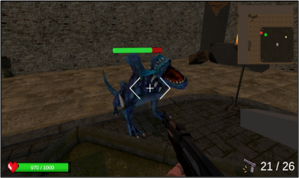
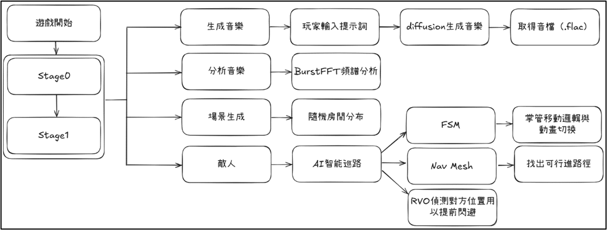

# Rhythm is Combat: 節奏即戰鬥 🎵🔫
**A Rhythm FPS Game Based on Diffusion Music Generation and Enemy AI Obstacle Avoidance**

## 作者
指導老師：李同益 教授
專題成員：周柏儒、張育銓

## 專案簡介
《Rhythm is Combat》是一款結合 **AI 音樂生成** 與 **智慧型敵人導航** 的 3D 節奏射擊遊戲。  
玩家透過輸入提示詞，由 **Diffusion 模型** 即時生成音樂，並利用 **BurstFFT** 分析節奏，產生節拍判定。  
在遊戲中，玩家必須跟隨節拍射擊才能造成有效傷害，而敵人則透過 **FSM 狀態機** 與 **RVO 避障演算法** 配合 **NavMesh** 進行移動，展現自然且多變的行為。

## 系統架構
- **音樂生成 (Music Generation)**  
  - 採用 Stable Audio (Diffusion model) 根據提示詞生成音樂  
  - 使用 CLIP 提示詞編碼作為 conditioning  
  - 最終輸出 `.flac` 音檔  

- **節奏分析 (Rhythm Analysis)**  
  - 使用 **BurstFFT** 進行快速傅立葉轉換 (FFT)  
  - 偵測頻率與能量變化，提取節拍點作為遊戲判定依據  

- **敵人 AI (Enemy AI)**  
  - **FSM (Finite State Machine)**：待機、巡邏、追擊、攻擊、受傷、死亡  
  - **NavMesh**：規劃全局路徑  
  - **RVO (Reciprocal Velocity Obstacles)**：即時避障，讓敵人移動更自然  

- **玩家控制 (Player Controller)**  
  - 高機動動作：跳躍、滑鏟、跑牆、鉤鎖  
  - 第一人稱射擊操作，槍枝與視角綁定並具備 Weapon Sway 動態效果  

## 技術亮點
- **ComfyUI 工作流整合**：串接 Stable Audio 生成音樂  
- **BurstFFT 高效能分析**：相較傳統 FFT 更快，適合即時遊戲判定  
- **RVO 避障演算法**：雙邊責任制避障，行為自然流暢  
- **Unity NavMesh + FSM 整合**：結合全局路徑與局部智慧行為  

## 成果展示
- 即時生成音樂與節奏判定  
- 敵人能動態避障、追擊與攻擊玩家  
- 玩家能進行多樣高機動動作  
- 遊戲畫面具備沉浸感與節奏互動體驗  

  
  

## 未來展望
- 增加更多音樂風格與生成參數  
- 加入多人模式，提升互動性  
- 敵人 AI 導入強化學習，實現更高智慧決策  
- 移植至 VR / 手機平台，擴展應用場景  

---

🎶 *Rhythm is Combat — 讓音樂節奏化為武器！*
